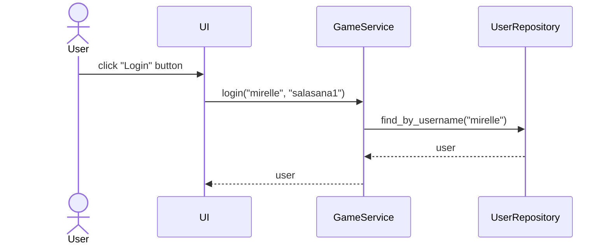
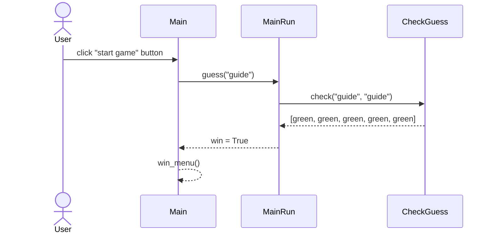

```mermaid
sequenceDiagram
  actor User
  participant UI
  participant GameService
  participant UserRepository
  User->>UI: click "Login" button
  UI->>GameService: login("mirelle", "salasana1")
  GameService->>UserRepository: find_by_username("mirelle")
  UserRepository-->>GameService: user
  GameService-->>UI: user
```

```mermaid
sequenceDiagram
  actor User
  participant Main
  participant MainRun
  participant CheckGuess
  User->>Main: click "start game" button
  Main->>MainRun: guess("guide")
  MainRun->>CheckGuess: check("guide", "guide")
  CheckGuess-->>MainRun:[green, green, green, green, green]
  MainRun-->>Main: win = True
  Main-->>Main: win_menu()
```

