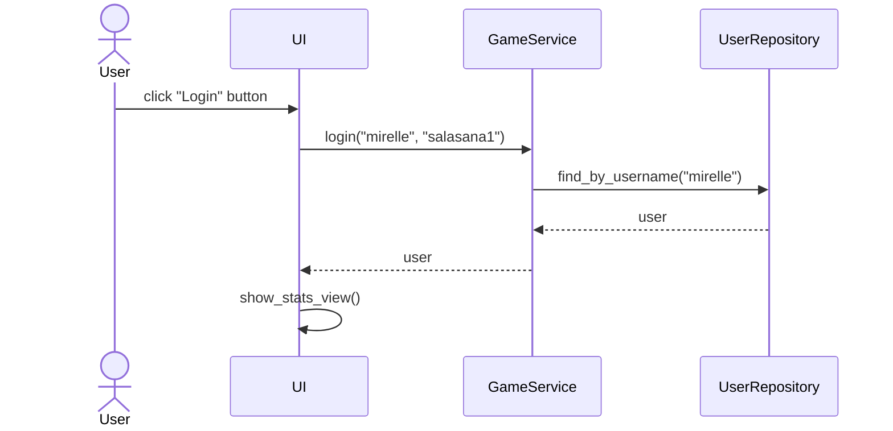
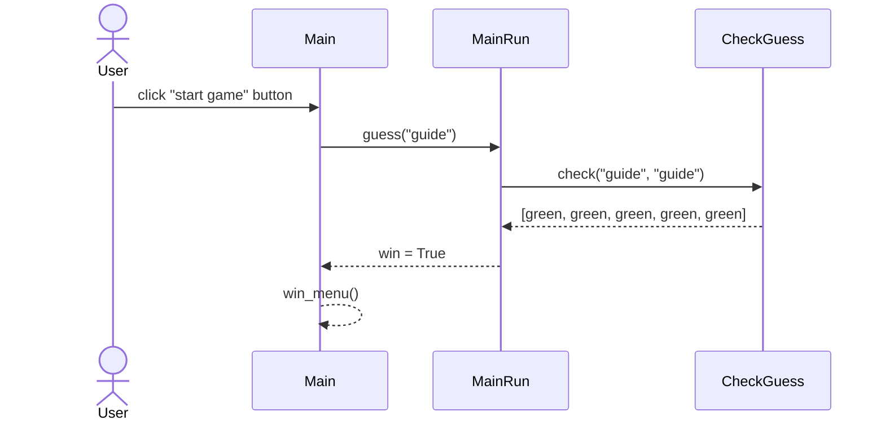

# Arkkitehtuurikuvaus

## Rakenne
Koodin pakkausrakenne on seuraava

Pakkaus ui sisältää käyttöliittymästä, services sovelluslogiikasta ja repositories tietojen pysyväistallennuksesta vastaavan koodin. Pakkaus entities sisältää luokan User, joka kuvaa sovelluksen käyttämää tietokohdetta user.

## Käyttöliittymä
Käyttöliittymä sisältää kuusi erillistä näkymää
- Kirjautuminen
- Uuden käyttäjän luominen
- Stats, mistä voi kirjautua ulos ja aloittaa pelin
- Pelin aloitusmenu
- Pelinäkymä
- Loppumenu riippuen voitosta

Kirjautuminen, uuden käyttäjän luominen, stats ja pelinäkymä on toteutennu omina luokkinaan. Pelin menut ovat samassa luokassa. Näkymien näyttämisestä vastaa [UI](../src/ui/ui.py) ja [Main](../src/ui/game_ui.py).

## Päätoiminnallisuudet
Kuvataan sovelluksen toimintalogiikkaa muutaman päätoiminnallisuuden osalta sekvenssikaavioina

### Sisäänkirjautuminen
Kun kirjautumisnäkymän syötekenttiin kirjoitetetataan käyttäjätunnus ja salasana, jonka jälkeen klikataan _Login_-nappia, etenee sovelluksen kontrolli seuraavasti:

### Pelin pelaaminen
Käyttäjän kirjaudutta sisään ja painettuaan _Play_-nappia, etenee sovelluksen kontrolli seuraavasti

