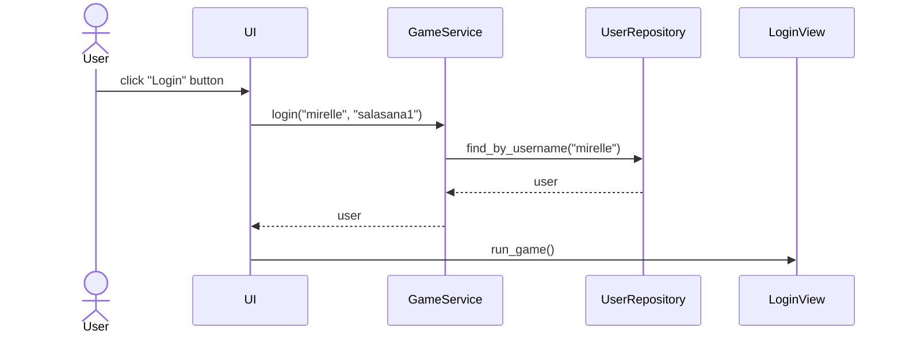

# Arkkitehtuurikuvaus

## Rakenne
Koodin pakkausrakenne on seuraava

Pakkaus ui sisältää käyttöliittymästä, services sovelluslogiikasta ja repositories tietojen pysyväistallennuksesta vastaavan koodin. Pakkaus entities sisältää luokan User, joka kuvaa sovelluksen käyttämää tietokohdetta user.

## Käyttöliittymä
Käyttöliittymä on jakautunut käyttäjäkäyttöliittymään ja pelikäyttöliittymään

__Käyttäjäkäyttöliittymä__
- sisäänkirjautumisnäkymä
- näkymä uuden käyttäjän luomiseen

__Pelikäyttöliittymä__
- aloitusmenu, jossa näkyy mm. pelitilastot
- pelinäkymä
- loppumenu riippuen voitosta

Kirjautuminen, uuden käyttäjän luominen, stats ja pelinäkymä on toteutennu omina luokkinaan. Pelin menut ovat samassa luokassa. Näkymien näyttämisestä vastaa [UI](../src/ui/ui.py) ja [Main](../src/ui/game_ui.py).

## Sovelluslogiikka
Pelin sovelluslogiikasta vastaa [CheckGuess](../src/services/checkguess.py)-luokka, joka vertaa pelaajan arvausta oikeaan sanaan ja palauttaa listan värejä, jotka kertovat oikeat ja väärät kirjaimet arvauksessa

Toiminnallisista kokonaisuuksista vastaa luokka [GameService](../src/services/game_service.py)
Luokka tarjoaa käyttäjäkäyttöliittymän toiminnoille oman metodin. Näitä ovat esimerkiksi:

- `login(username, password)`
- `logout()`
- `create_user(username, password, login=True)`

_GameService_ pääsee käsiksi käyttäjiin [UserRepository](../src/repositories/user_repository)-luokan kautta. _UserRepository_ vastaa tietojen tallennuksesta. 

## Tietojen pysyväistallennus
Pakkauksen _repositories_ luokka `UserRepository` huolehtii tietojen tallentamisesta. Luokka tallentaa tietoa SQLite-tietokantaan. 

## Tiedostot

Käyttäjät tallennetaan SQLite-tietokannan tauluun `users`, joka alustetaan [initialize_database.py](../src/initialize_database.py)-tiedostossa.

## Päätoiminnallisuudet
Kuvataan sovelluksen toimintalogiikkaa muutaman päätoiminnallisuuden osalta sekvenssikaavioina

### Sisäänkirjautuminen
Kun kirjautumisnäkymän syötekenttiin kirjoitetetataan käyttäjätunnus ja salasana, jonka jälkeen klikataan _Login_-nappia, etenee sovelluksen kontrolli seuraavasti:

### Pelin pelaaminen
Käyttäjän kirjaudutta sisään ja painettuaan _Play_-nappia, etenee sovelluksen kontrolli seuraavasti

## Ohjelman rakenteeseen jääneet heikkoudet

### Käyttöliittymä

Graafisen käyttöliittymän koodissa on jonkin verran toisteisuuttaa, josta voisi toteuttaa omia komponenttejaan. 

### Sovelluslogiikka
Sisäänkirjautumisen jälkeen ei voi enää kirjautua ulos, vaan sovellus pitää sulkea pelinäkymän "Guit game"-napista
