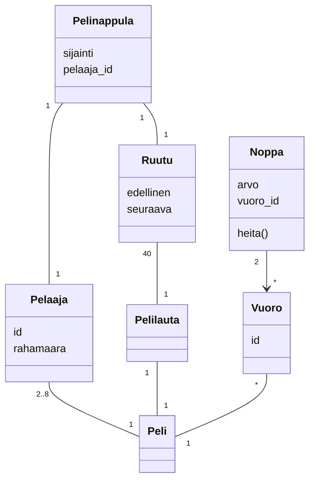

```mermaid
 classDiagram
      Pelaaja "2..8" -- "1" Peli
      Noppa "2" --> "*" Vuoro
      Ruutu "40" -- "1" Pelilauta
      Pelilauta "1" -- "1" Peli
      Vuoro "*" -- "1" Peli
      Pelinappula "1" -- "1" Pelaaja
      Pelinappula "1" -- "1" Ruutu
      
      class Peli{
          
      }
      class Vuoro{
          id
      }
      class Noppa{
          arvo
          heita()
          vuoro_id
       
      }
      class Pelaaja{
          id
          rahamaara
        
      }
      class Pelilauta{
         
      }
      class Ruutu{
          edellinen
          seuraava
      }
      class Pelinappula{
          sijainti
          pelaaja_id
          
      }
```
