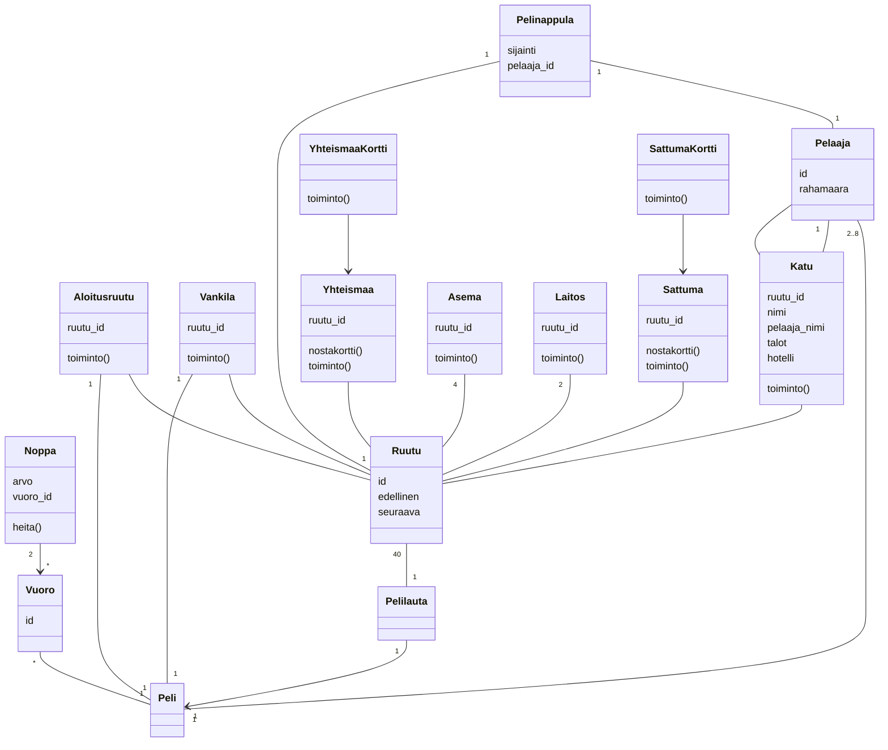

```mermaid
 classDiagram
      Pelaaja "2..8" -- "1" Peli
      Noppa "2" --> "*" Vuoro
      Ruutu "40" -- "1" Pelilauta
      Pelilauta "1" --> "1" Peli
      Vuoro "*" -- "1" Peli
      Pelinappula "1" -- "1" Pelaaja
      Pelinappula "1" -- "1" Ruutu
      Aloitusruutu -- Ruutu
      Vankila -- Ruutu
      Sattuma -- Ruutu
      Yhteismaa -- Ruutu
      Asema "4"-- Ruutu
      Laitos "2"-- Ruutu
      Katu -- Ruutu
      Katu -- Pelaaja
      YhteismaaKortti --> Yhteismaa
      SattumaKortti --> Sattuma
      Vankila "1" -- "1" Peli
      Aloitusruutu "1" -- "1" Peli
      Pelaaja "1" -- Katu
      
      class Peli{
      }
      class Vuoro{
          id
      }
      class Noppa{
          arvo
          heita()
          vuoro_id
       
      }
      class Pelaaja{
          id
          rahamaara
        
      }
      class Pelilauta{
         
      }
      class Ruutu{
          id
          edellinen
          seuraava
      }
      class Pelinappula{
          sijainti
          pelaaja_id
      }
      
      class Aloitusruutu{
          ruutu_id
          toiminto()
      }
      class Vankila{
          ruutu_id
          toiminto()
      }
      class Sattuma{
          ruutu_id
          nostakortti()
          toiminto()
      }
      class Yhteismaa{
          ruutu_id
          nostakortti()
          toiminto()
      }
      class Asema{
          ruutu_id
          toiminto()
      }
      class Laitos{
          ruutu_id
          toiminto()
      }
      class Katu{
          ruutu_id
          nimi
          toiminto()
          pelaaja_nimi
          talot
          hotelli
      }
      class SattumaKortti{
          toiminto()
      }
      class YhteismaaKortti{
          toiminto()
          
      }
      
```
