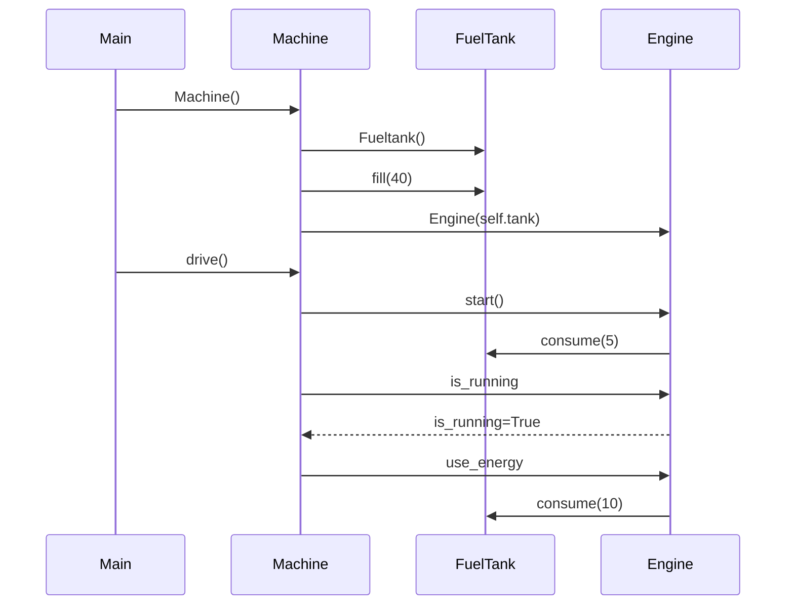

```mermaid
      sequenceDiagram
          Main->>Machine: Machine()
          Machine->>FuelTank: Fueltank()
          Machine->>FuelTank: fill(40)
          Machine->>Engine: Engine(self.tank)
          Main->>Machine: drive()
          Machine->>Engine: start()
          Engine->>FuelTank: consume(5)
          Machine->>Engine: is_running
          Engine-->>Machine: is_running=True
          Machine->>Engine: use_energy
          Engine->>FuelTank: consume(10)
          
    
```
